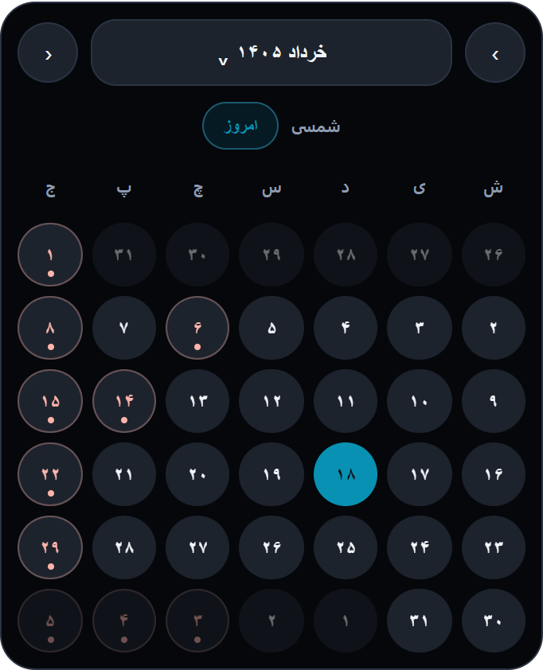
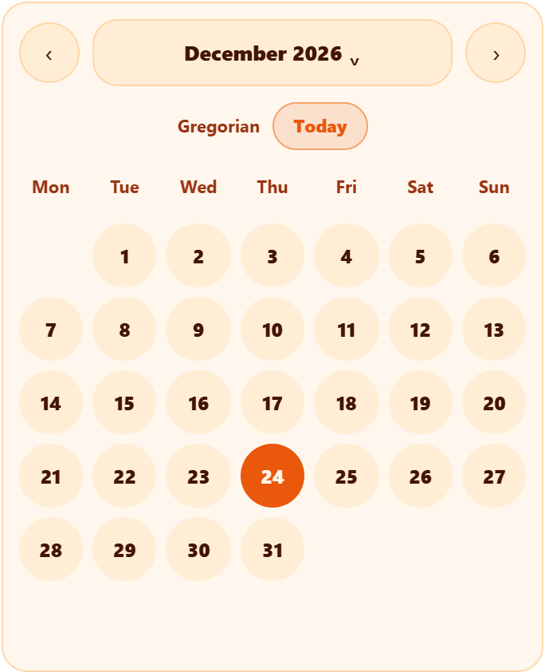
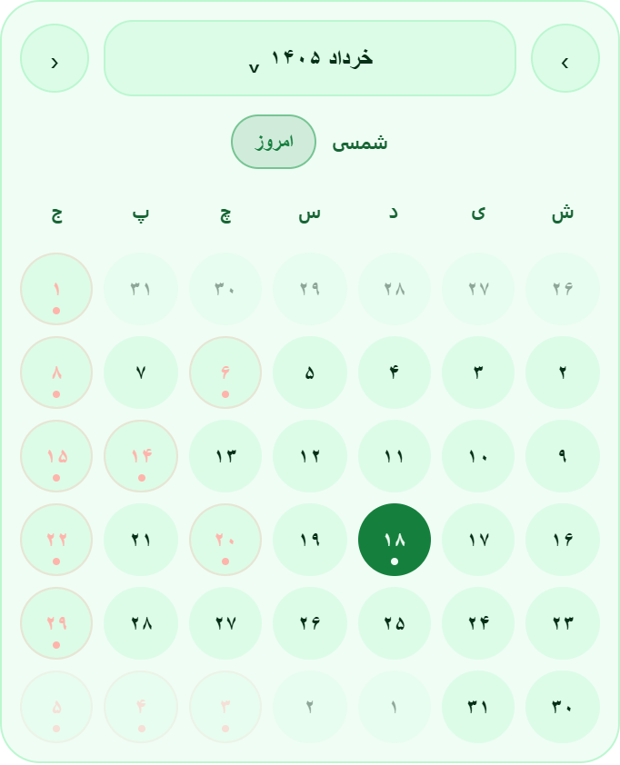
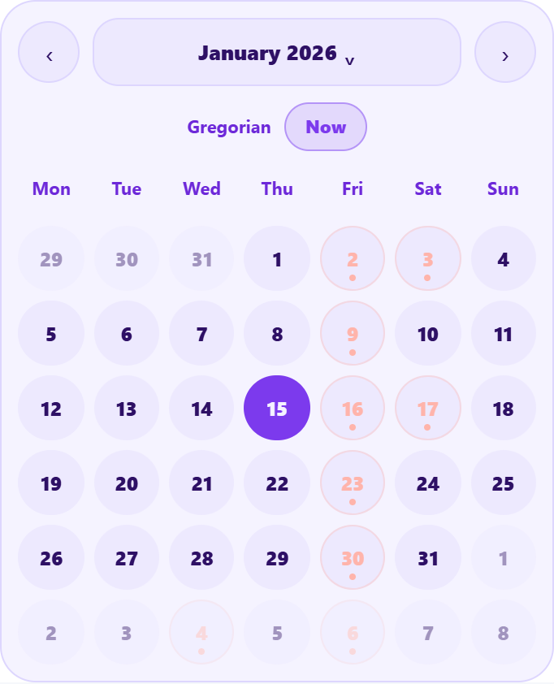
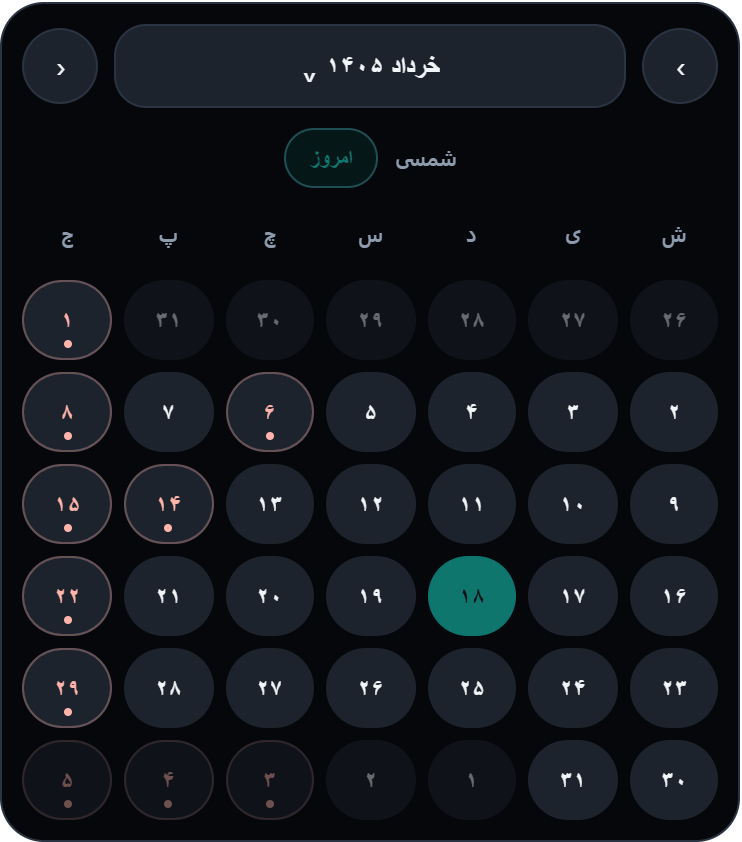

# Calendar

<p align="center">
  <strong>A standalone Gregorian and Jalali date picker for modern web apps.</strong><br>
  <span dir="rtl">یک دیت‌پیکر مستقل برای تقویم میلادی و شمسی، بدون وابستگی به فریم‌ورک.</span>
</p>

<p align="center">
  
  
  
  
</p>

## Overview

**Calendar** renders a complete date picker inside any empty HTML element. It supports Jalali and Gregorian calendars, Persian and English labels, holidays, custom themes, month and year navigation, DOM events, and a lower-level calendar engine for custom UI work.

<p dir="rtl">
  <strong>Calendar</strong> یک تقویم انتخاب تاریخ کامل را داخل هر المنت خالی رندر می‌کند. این کتابخانه از تقویم شمسی و میلادی، برچسب‌های فارسی و انگلیسی، تعطیلی‌ها، تم‌های سفارشی، انتخاب ماه و سال، رویدادهای DOM و موتور سطح پایین برای ساخت UI اختصاصی پشتیبانی می‌کند.
</p>

## Highlights

- Framework-free, dependency-free vanilla JavaScript.
- Jalali and Gregorian calendar modes.
- Persian and English UI labels.
- API-safe selected values in Gregorian `YYYY-MM-DD` format.
- Built-in Iranian fixed holidays and known 1404-1406 holidays.
- Custom holidays and holiday provider support.
- Month picker, year picker, today button, adjacent days, compact density.
- Themeable with CSS variables.
- TypeScript declaration file included.
- ESM import and browser global usage.

<p dir="rtl">
  بدون وابستگی به React، Angular، Tailwind یا هر فریم‌ورک دیگر. خروجی انتخاب تاریخ همیشه به شکل امن و قابل ذخیره `YYYY-MM-DD` است، حتی وقتی UI تقویم شمسی نمایش داده می‌شود.
</p>

## Screenshots

<table>
  <tr>
    <td width="48%">
      <h3>Jalali Persian Picker</h3>
      <p><strong>EN:</strong> A full Persian Jalali calendar with RTL layout, Persian digits, Saturday week start, today action, holidays, and Gregorian output keys.</p>
      <p dir="rtl"><strong>FA:</strong> تقویم شمسی فارسی با چینش راست‌به‌چپ، اعداد فارسی، شروع هفته از شنبه، دکمه امروز، نمایش تعطیلی‌ها و خروجی میلادی استاندارد.</p>
    </td>
    <td width="52%" align="center">
      
    </td>
  </tr>
  <tr>
    <td width="48%">
      <h3>Gregorian Compact Mode</h3>
      <p><strong>EN:</strong> An English Gregorian picker using compact density, a warm theme, hidden adjacent-month days, and Monday as the first weekday.</p>
      <p dir="rtl"><strong>FA:</strong> نمونه میلادی انگلیسی با حالت کامپکت، تم گرم، مخفی بودن روزهای ماه مجاور و شروع هفته از دوشنبه.</p>
    </td>
    <td width="52%" align="center">
      
    </td>
  </tr>
  <tr>
    <td width="48%">
      <h3>Custom Holidays</h3>
      <p><strong>EN:</strong> Combines built-in holidays, recurring Jalali holiday keys, one-off holiday keys, and a custom provider callback for dynamic labels.</p>
      <p dir="rtl"><strong>FA:</strong> ترکیب تعطیلی‌های داخلی، تعطیلی‌های تکرارشونده شمسی، تاریخ‌های خاص و تابع سفارشی برای ساخت عنوان‌های پویا.</p>
    </td>
    <td width="52%" align="center">
      
    </td>
  </tr>
  <tr>
    <td width="48%">
      <h3>Browser Global Usage</h3>
      <p><strong>EN:</strong> After loading the module, the picker is also available through <code>window.IDoCalendar</code> for script-tag driven pages.</p>
      <p dir="rtl"><strong>FA:</strong> بعد از load شدن ماژول، می‌توان بدون import مستقیم و از طریق <code>window.IDoCalendar</code> تقویم را mount کرد.</p>
    </td>
    <td width="52%" align="center">
      
    </td>
  </tr>
  <tr>
    <td width="48%">
      <h3>Programmatic API</h3>
      <p><strong>EN:</strong> Control the picker after mount with <code>setDate</code>, <code>setViewDate</code>, <code>setOptions</code>, <code>render</code>, and <code>destroy</code>.</p>
      <p dir="rtl"><strong>FA:</strong> بعد از mount می‌توان تاریخ، ماه قابل مشاهده، گزینه‌ها، رندر و نابودی instance را با API برنامه‌ای کنترل کرد.</p>
    </td>
    <td width="52%" align="center">
      
    </td>
  </tr>
</table>

## Installation

```bash
npm install ido-calendar
```

```js
import { mountIDoCalendar } from 'ido-calendar';
import 'ido-calendar/style.css';

mountIDoCalendar('calendar', {
  calendarType: 'Jalali',
  locale: 'fa'
});
```

For local development or direct browser usage, import from the source files:

```html
<link rel="stylesheet" href="./src/ido-calendar.css">
<div id="calendar"></div>

<script type="module">
  import { mountIDoCalendar } from './src/ido-calendar.js';

  mountIDoCalendar('calendar', {
    calendarType: 'Jalali',
    locale: 'fa',
    selectedDate: '2026-06-08',
    accent: '#00e6f6'
  });
</script>
```

<p dir="rtl">
  برای استفاده مستقیم در مرورگر، فایل CSS و ماژول JavaScript را اضافه کنید و سپس تقویم را روی یک المنت خالی mount کنید.
</p>

## Quick Start

```html
<div id="calendar"></div>
```

```js
import { mountIDoCalendar } from './src/ido-calendar.js';

const picker = mountIDoCalendar('calendar', {
  calendarType: 'Jalali',
  locale: 'fa',
  selectedDate: '2026-06-08',
  weekStartDay: 'Saturday',
  onChange: ({ date, parts, calendarType }) => {
    console.log(date, parts, calendarType);
  }
});
```

The selected date is always returned as a Gregorian API-safe key:

```text
2026-06-08
```

<p dir="rtl">
  مقدار انتخاب‌شده همیشه با فرمت میلادی استاندارد برگردانده می‌شود تا ذخیره‌سازی، ارسال به API و مقایسه تاریخ‌ها ساده و قابل اعتماد باشد.
</p>

## Browser Global

```html
<link rel="stylesheet" href="./src/ido-calendar.css">
<div id="calendar"></div>

<script type="module" src="./src/ido-calendar.js"></script>
<script type="module">
  window.IDoCalendar.mount('calendar', {
    calendarType: 'Gregorian',
    locale: 'en'
  });
</script>
```

## API

```js
const picker = mountIDoCalendar('calendar', options);

picker.setDate('2026-06-08');
picker.setViewDate('2026-07-01');
picker.setOptions({ calendarType: 'Jalali', locale: 'fa' });
picker.render();
picker.destroy();
```

### Calendar Engine

```js
import { IDoCalendar } from './src/ido-calendar.js';

const engine = new IDoCalendar({
  calendarType: 'Jalali',
  locale: 'fa'
});

const month = engine.buildMonthView('2026-06-08', '2026-06-08');
const timeline = engine.buildTimeline('2026-06-08', 4, 4);

console.log(month.title, timeline);
```

<p dir="rtl">
  اگر UI آماده کافی نیست، کلاس <code>IDoCalendar</code> برای ساخت تقویم سفارشی، تایم‌لاین، تبدیل تاریخ و استخراج اطلاعات ماه قابل استفاده است.
</p>

## Options

```ts
interface CalendarPickerOptions {
  selectedDate?: string | null;
  calendarType?: 'Gregorian' | 'Jalali';
  locale?: 'en' | 'fa' | 'fa-IR' | 'Persian';
  weekStartDay?: 'Sunday' | 'Monday' | 'Saturday' | 0 | 1 | 6;
  showCalendarLabel?: boolean;
  showTodayButton?: boolean;
  showMonthSelector?: boolean;
  showYearSelector?: boolean;
  showAdjacentDays?: boolean;
  fixedWeekCount?: boolean;
  showHolidays?: boolean;
  usePersianDigits?: boolean;
  yearRange?: number;
  yearPageSize?: number;
  density?: 'comfortable' | 'compact';
  accent?: string;
  dir?: 'ltr' | 'rtl';
  labels?: CalendarPickerLabels;
  holidays?: { key: string; title: string }[];
  holidayProvider?: (
    key: string,
    context: { date: Date; parts: CalendarDateParts }
  ) => string | string[] | null | undefined;
  onChange?: (detail: CalendarPickerChangeDetail) => void;
  onViewChange?: (detail: CalendarPickerViewChangeDetail) => void;
}
```

## Events

Use callbacks:

```js
mountIDoCalendar('calendar', {
  onChange: ({ date, dateObject, parts, calendarType }) => {
    console.log(date, dateObject, parts, calendarType);
  },
  onViewChange: ({ viewDate, parts }) => {
    console.log(viewDate, parts);
  }
});
```

Or listen to DOM events:

```js
document.getElementById('calendar').addEventListener('ido-calendar:change', event => {
  console.log(event.detail.date);
});
```

## Custom Holidays

```js
mountIDoCalendar('calendar', {
  calendarType: 'Jalali',
  locale: 'fa',
  holidays: [
    { key: '1405-03-18', title: 'Release day' },
    { key: '03-20', title: 'Monthly event' }
  ],
  holidayProvider: key => key === '2026-06-08' ? 'Demo day' : null
});
```

Holiday keys in `holidays` can be full Jalali keys like `1405-03-18` or recurring Jalali month/day keys like `03-20`. The `holidayProvider` receives the rendered Gregorian key.

<p dir="rtl">
  کلید تعطیلی‌ها می‌تواند تاریخ کامل شمسی مثل <code>1405-03-18</code> یا ماه/روز تکرارشونده مثل <code>03-20</code> باشد. تابع <code>holidayProvider</code> کلید میلادی روز در حال رندر را دریافت می‌کند.
</p>

## Theming

Override CSS variables on the target element or on `.ido-calendar`:

```css
#calendar {
  --ido-calendar-accent: #00f4b9;
  --ido-calendar-surface: #080b10;
  --ido-calendar-raised: #171d26;
  --ido-calendar-border: #2a3341;
  --ido-calendar-text: #f2f5f8;
  --ido-calendar-muted: #8e9bae;
  --ido-calendar-error: #ffb4ab;
  --ido-calendar-bg: #0b0e14;
  --ido-calendar-radius: 22px;
}
```

## Development

```bash
npm run smoke
```

The smoke test validates the core exports, month grid generation, date movement, and Gregorian date validation.

## License

MIT

<p align="center">
  Made with 🤍 by Azadiyan<br>
  <span dir="rtl">ساخته شده با 🤍 توسط آزادیان</span>
</p>
